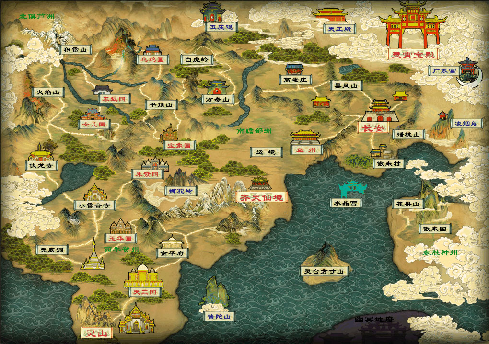

# 西游记人物地图

> 一个帮助女儿理解《西游记》的交互式人物关系与地理地图项目

## 缘起

女儿最近迷上了《西游记》，每天缠着我讲故事。她的小脑瓜里总是装满了问题：

> "爸爸，玉皇大帝和如来佛祖谁更厉害？"
> "孙悟空的师父是谁？"
> "唐僧他们走了多远啊？"
> "这个妖怪是谁的坐骑？"

很多人物我也只有个大概印象，被问多了就开始心虚。索性创建这个项目，把整个西游世界梳理清楚：

- 🗺️ **地理位置**：从长安到灵山，取经路上的每一站
- 👥 **人物关系**：天庭、灵山、地府、龙宫、妖界的势力布局
- 📖 **故事串联**：八十一难的前因后果
- 🔗 **上下级关系**：谁管谁，谁是谁的坐骑，谁是谁的徒弟

## 功能

### 交互地图



- **缩放拖拽**：支持鼠标滚轮缩放和拖拽平移
- **热点提示**：悬停显示地点名称和所属区域
- **详情联动**：点击地点显示详细信息和相关人物
- **路线展示**：完整展示取经路线

### 人物架构

每个地点都梳理了相关人物的上下级关系：

```
凌霄宝殿
└── 玉皇大帝（三界之主）
    ├── 三清
    │   ├── 元始天尊
    │   ├── 灵宝天尊
    │   └── 太上老君
    ├── 四大天师
    │   ├── 张道陵
    │   ├── 葛洪
    │   ├── 许逊
    │   └── 邱弘济
    ├── 太白金星
    └── 武将系统
        ├── 托塔天王李靖
        │   └── 哪吒
        └── 二郎神杨戬
```

### 数据文件

| 文件 | 说明 |
|------|------|
| `character-data.json` | 完整人物数据（含品级、势力、描述） |
| `character-hierarchy.md` | 人物架构关系文档 |
| `character-csv/*.csv` | 按地点拆分的人物关系（37个文件） |
| `poi-data.js` | 地图POI数据 |

## 运行

```bash
# Python
python -m http.server 8080

# Node.js
npx serve .
```

然后访问 http://localhost:8080

## 技术栈

- 纯前端：HTML + CSS + JavaScript ES Modules
- 无框架依赖
- SVG 矢量图层
- 支持触屏交互

## 项目结构

```
xiyouji/
├── index.html              # 主页面
├── scripts/
│   ├── main.js            # 入口文件
│   ├── poi-data.js        # 地图数据
│   ├── map-renderer.js    # 渲染模块
│   ├── map-controls.js    # 交互控制
│   └── character-panel.js # 人物面板
├── styles/
│   ├── base.css
│   ├── map.css
│   └── poi.css
├── character-csv/         # 按地点拆分的人物CSV
├── character-data.json    # 完整人物数据
└── tests/                 # 测试文件
```

## TODO

- [ ] 补充八十一难详细故事
- [ ] 添加妖怪与主人的关系线
- [ ] 取经时间线可视化
- [ ] 移动端适配优化

---

*希望这个项目能帮助更多像我一样被孩子问倒的家长 🙈*
